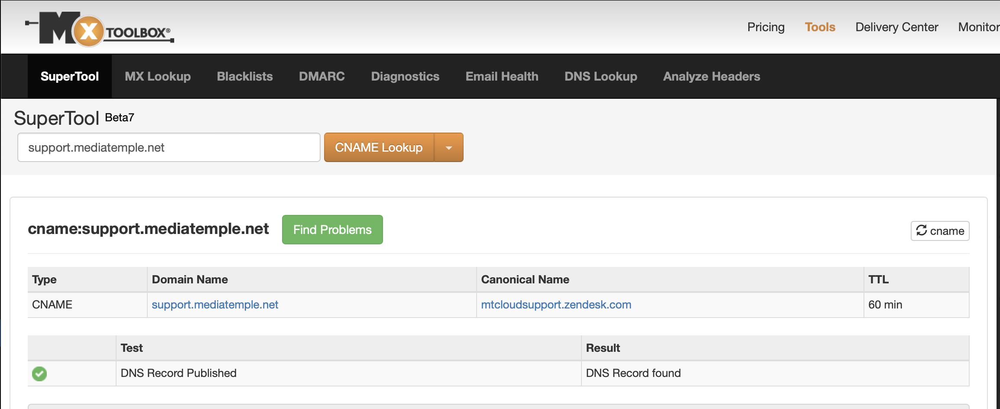

# Momementum Tech Task

An important data point for many of the companies we work with is are they currently using a competitor.

One of the companies more specifically wants to know is a company using Zendesk or not.

The best way we’ve found so far to do this is domain crawling. We find 2 key points:

---

1: Does the company have a Zendesk login page?

A compony login page is structured in the following way https://{COMPANY_NAME/BASEDOMAIN}.zendesk.com

An example would be https://www.laseraway.com has a Zendesk login of: https://laseraway.zendesk.com

If the url returns 200 then we accept that the company has a login page

2: Does the company have a support page that points to a Zendesk host page?

For the purpose of the exercise assume that the main support pages are structured as support.basedomain.com or help.basedomain.com

The way we check for Zendesk is with a cname look up, if the cname points to a domain ending in .zendesk.com that means they are using Zendesk for their support page.

For example mediatemplate.net has a support page support.mediatemple.net that points to the following cname: mtcloudsupport.zendesk.com, meaning they are hosting their support page on Zendesk. MXToolBox is a great way to manually check a domain:

---

In reality we combine this with a few other methods as these are not 100% accurate but they provide a good indicator.

For the task we would like you to build an api that ingests a list of company domains and returns a response that returns the companies Zendesk login page url and the companies Zendesk support page url if they are a successful match.

We have provided a base Express + Typescript app. As well as a list of sample companies that we know have Zendesk to test with.
